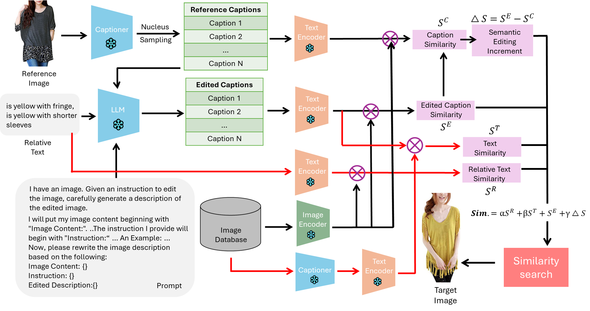

# IR Final Project



# Project Structure
Composed image retrieval takes as inputs an image and a textual description of editing the image, and retrieves relevant images based on the input image and the editing text. Our pipeline is based on [SEIZE (2024 paper)](https://github.com/yzy-bupt/SEIZE/tree/main) and has 3 steps:
- The first step takes input images in FashionIQ validation data and produces their captions using a BLIP model. This is done by `src/multi_caption_generator_fashioniq.py`.
- The second step uses an LLM to generate composed captions based on the images captions from step 1 and the editing text provided by the dataset. This is done by `src/LLM-based_editing_reasoner_fashioniq_v1.py`.
- The last step takes the textual captions from steps 1 and 2, uses CLIP to transform them into CLIP vectors, transforms images in the retrieval database to CLIP vectors as well, and uses these CLIP vectors to calculate scores for ranking. This is done by `src/semantic_editing_search_v1.py`.

# Environment Setup
This is arranged from the installation guide of [SEIZE repository](https://github.com/yzy-bupt/SEIZE/tree/main).

To use the original OpenAI GPT for caption generation, create an environment with python 3.9.x:    
```
conda create -n SEIZE -y python=3.9.20
conda activate SEIZE
```

Then, install `torch==1.11.0` and `torchvision==0.12.0` in the environment. 

Finally, run
```
pip install -r requirements.txt
```

### Note for LLaMA2-7B
To use LLaMA2-7B instead of OpenAI GPT, and if you are running step 2, you need to create another environment and set it up with Hugging Face.
```
torch==2.7.0
torchaudio==2.7.0
torchvision==0.22.0
transformers==4.49.0
```
For steps 1 and 3, use the same environment described above.

## Dataset
We use FashionIQ dataset for evaluation. Please download it at [https://disk.yandex.com/d/Z2E54WCwvrQA3A](https://disk.yandex.com/d/Z2E54WCwvrQA3A). Download and unzip it at any directory you are used to -- later, you will create a link at a specified place that directs to the contents of this dataset. For more reference, see https://github.com/XiaoxiaoGuo/fashion-iq/issues/18.

# Running the Experiment
You don't have to run steps 1 and 2, namely
```
python src/multi_caption generator_fashioniq.py
python src/LLM-based_editing_reasoner_fashioniq_v1.py
```
because we have stored the output captions in the directory `exp_captions`. However, you can run the steps if you want to try different prompts for LLMs or try different LLMs. 

Inside `exp_captions`, 
- `captions_gpt_15` stores the output captions of steps 1 and 2 when GPT 3.5 is used as the LLM and the image captioner generates 15 captions.
- `captions_Llama2_15` stores the output captions of steps 1 and 2 when Llama2-7b is used as the LLM and the image captioner generates 15 captions.

Running step 3 looks like
```
python src/semantic_editing_search_v1.py \
 --dataset              fashioniq \
 --dataset_path         FashionIQ_multi_opt_gpt35_5 \
 --gpt_version          gpt-3.5 \
 --submission_name      "multi_opt_gpt35_5" \
 --gpt_version          gpt-3.5\
 --caption_type         opt \
 --model_type           SEIZE-G \
 --use_momentum_strategy True \
 --pos_factor           0.13 \
 --neg_factor           2.1 \
 --alpha               0 \
 --beta                0 \
 --nums_caption         15
```
Before running, please make sure that the directory `FashionIQ_multi_opt_gpt35_5` contains
- A link to the `images` directory inside the FashionIQ dataset.
- A link to the `image_splits` directory inside the FashionIQ dataset.
- A copy of a directory of captions inside `exp_captions`. Please rename the copy to `captions`. 

If you want to see retrieval results using GPT3.5 and 15-multi-caption captions, copy `exp_captions/captions_gpt_15` into `FashionIQ_multi_opt_gpt35_5`. If you want to see retrieval results using Llama2 and 15-multi-caption captions, copy `exp_captions/captions_Llama2_15` into `FashionIQ_multi_opt_gpt35_5`.

More precisely, before running, make sure that the directory `FashionIQ_multi_opt_gpt35_5` contains
```
|-- captions
    |-- cap.dress.val.json
    |-- cap.shirt.val.json
    |-- cap.toptee.val.json
| -- image_splits
| -- images
```

### Reproducing the Numbers in Experiment Results section
To reproduce the numbers under "LLM: GPT3.5 captions-num=15" in the experiment results section, please
- Make sure that `FashionIQ_multi_opt_gpt35_5/captions` is a copy of `exp_captions/captions_gpt_15`. 
- Make sure that `feature` is a link to `feature_gpt35_ncaps15`, which is a cache of CLIP vectors to speed up the score computations. 

Finally, run `./run_sem_gpt35_ncaps15_{i}.sh` to reproduce the numbers of block `i`. 

To reproduce the numbers under "LLM: Llama2-7b captions-num=15" in the experiment results section, please
- Make sure that `FashionIQ_multi_opt_gpt35_5/captions` is a copy of `exp_captions/captions_Llama2_15`. 
- Make sure that `feature` is a link to `feature_Llama2_ncaps15`, which is a cache of CLIP vectors to speed up the score computations. 

Finally, run `./run_sem_Llama2_ncaps15_{i}.sh` to reproduce the numbers of block `i`. 

# Experiment Results

### Ablation Study Results (FashionIQ Recall)

#### LLM: LLama2-7B captions-num=5
| Category | Model | pos_factor | neg_factor | add_original| Recall@10 (%) | Recall@50(%) |
|----|---|------|---|---|--------|--------|
| Shirt | SEIZE-g | 0.5 | 0 | ✔️ | 33.32 | 52.60 |
| Dress | SEIZE-g | 0.5 | 0 | ✔️ | 28.06 | 50.27 |
| Toptee | SEIZE-g | 0.5 | 0 | ✔️ | 37.48 | 59.15 |
| **Average** | | | | **32.95** | **54.01** |
| | | | | | | |
| Shirt | SEIZE-G | 0.5 | 0 | ✔️ | 34.59 | 52.75 |
| Dress | SEIZE-G | 0.5 | 0 | ✔️ | 26.82 | 48.83 |
| Toptee | SEIZE-G | 0.5 | 0 | ✔️ | 37.43 | 60.22 |
| **Average** | | | | **32.95** | **53.94** |
| | | | | | | |
| Shirt | SEIZE-H | 0.5 | 0 | ✔️ | 32.58 | 51.28 |
| Dress | SEIZE-H | 0.5 | 0 | ✔️ | 27.66 | 49.43 |
| Toptee | SEIZE-H | 0.5 | 0 | ✔️ | 35.95 | 60.28 |
| **Average** | | | | **32.07** | **53.66** |
| | | | | | | |
| Shirt | SEIZE-H | 0.5 | 0 | ✔️ | 32.58 | 51.28 |
| Dress | SEIZE-H | 0.5 | 0 | ✔️ | 27.66 | 49.43 |
| Toptee | SEIZE-H | 0.5 | 0 | ✔️ | 35.95 | 60.28 |
| **Average** | | | | **32.07** | **53.66** |
| | | | | | | |
| Shirt | SEIZE-L | 0.5 | 0 | ❌ | 25.42 | 41.12 |
| Dress | SEIZE-L | 0.5 | 0 | ❌ | 18.00 | 39.12 |
| Toptee | SEIZE-L | 0.5 | 0 | ❌ | 25.04 | 47.12 |
| **Average** | | | | **22.82** | **42.45** |
| | | | | | | |
| Shirt | SEIZE-g | default | default | ❌ | 33.91 | 51.37|
| Dress | SEIZE-g | default | default | ❌ | 26.62 | 47.00 |
| Toptee | SEIZE-g | default | default | ❌ | 34.83 | 56.40 |
| **Average** | | | | **31.79** | **51.59** |


#### LLM: GPT3.5 captions-num=5
| Category | Model | pos_factor | neg_factor | add_original| Recall@10 (%) | Recall@50(%) |
|----|---|------|---|---|--------|--------|
| Shirt | SEIZE-g | 0.5 | 0 | ❌ |  |  |
| Dress | SEIZE-g | 0.5 | 0 | ❌ | 31.38 | 53.74 |
| Toptee | SEIZE-g | 0.5 | 0 | ❌ |  |  |
| **Average** | | | | |  |
| | | | | | | |
| Shirt | SEIZE-g | 0.5 | 0 | ✔️ |  |  |
| Dress | SEIZE-g | 0.5 | 0 | ✔️ | 30.64 | 52.80 |
| Toptee | SEIZE-g | 0.5 | 0 | ✔️ |  |  |
| **Average** | | | | |  |
| | | | | | | |
| Shirt | SEIZE-g | default | default  | ❌ |  |  |
| Dress | SEIZE-g | default  | default  | ❌ | 30.59 | 53.40 |
| Toptee | SEIZE-g | default  | default  | ❌ |  |  |

-------------------------------------------
**NEW Update**

#### LLM: LLama2-7B captions-num=15
| Category | Model | pos_factor | neg_factor | add_original| Recall@10 (%) | Recall@50(%) |
|----|---|------|---|---|--------|--------|
| Shirt | SEIZE-g | 0.5 | 0 | ✔️ | 33.42 | 53.19 |
| Dress | SEIZE-g | 0.5 | 0 | ✔️ | 28.16 | 50.47 |
| Toptee | SEIZE-g | 0.5 | 0 | ✔️ | 37.17 | 59.77 |
| **Average** | | | | **32.92** | **54.48** |
| | | | | | | |
| Shirt | SEIZE-g | 0.5 | 0 | ❌ | 34.30 | 54.02 |
| Dress | SEIZE-g | 0.5 | 0 | ❌ | 27.37 | 49.63 |
| Toptee | SEIZE-g | 0.5 | 0 | ❌ | 37.17 | 59.20 |
| **Average** | | | | **32.95** | **54.29** |
| | | | | | | |
| Shirt | SEIZE-g | default | default | ❌ | 34.54 | 53.73 |
| Dress | SEIZE-g | default | default | ❌ | 27.37 | 48.88 |
| Toptee | SEIZE-g | default | default | ❌ | 36.87 | 58.13 |
| **Average** | | | | **32.93** | **53.58** |
| | | | | | | |
| Shirt | SEIZE-G | default | default | ❌ | 35.72 | 54.37 |
| Dress | SEIZE-G | default | default | ❌ | 26.77 | 47.89 |
| Toptee | SEIZE-G | default | default | ❌ | 37.63 | 59.15 |
| **Average** | | | | **33.38** | **53.80** |


#### LLM: GPT3.5 captions-num=15

config: alpha=0.8, beta=0.25

| Category | Model | pos_factor | neg_factor | add_original| Recall@10 (%) | Recall@50(%) |
|----|---|------|---|---|--------|--------|
| Shirt | SEIZE-G | default | default | ❌ | 40.38 | 58.54 |
| Dress | SEIZE-G | default | default | ❌ | 31.73 | 54.73 |
| Toptee | SEIZE-G | default | default | ❌ | 40.39 | 63.84 |
| **Average** | | | | | **37.50** | **59.04** |
| | | | | | | |
| Shirt | SEIZE-G | default | default | ✔️ | 40.38 | 58.00 |
| Dress | SEIZE-G | default | default | ✔️ | 31.83 | 55.13 |
| Toptee | SEIZE-G | default | default | ✔️ | 40.80 | 64.41 |
| **Average** | | | | | **37.67** | **59.18** |
| | | | | | | |
| Shirt | SEIZE-G | 0.5 | 0 | ❌ | 40.53 | 59.52 |
| Dress | SEIZE-G | 0.5 | 0 | ❌ | 32.47 | 55.78 |
| Toptee | SEIZE-G | 0.5 | 0 | ❌ | 40.95 | 64.56 |
| **Average** | | | | | **37.98** | **59.95** |
| | | | | | | |
| Shirt | SEIZE-G | 0.5 | 0 | ✔️ | 40.09 | 59.13 |
| Dress | SEIZE-G | 0.5 | 0 | ✔️ | 32.42 | 55.83 |
| Toptee | SEIZE-G | 0.5 | 0 | ✔️ | 41.51 | 65.37 |
| **Average** | | | | | **38.01** | **60.11** |
| | | | | | | |
| Shirt | SEIZE-g | default | default | ❌ | 38.22 | 57.51 |
| Dress | SEIZE-g | default | default | ❌ | 31.43 | 54.93 |
| Toptee | SEIZE-g | default | default | ❌ | 40.49 | 62.88 |
| **Average** | | | | | **36.72** | **58.44** |
| | | | | | | |
| Shirt | SEIZE-g | default | default | ✔️ | 39.01 | 57.61 |
| Dress | SEIZE-g | default | default | ✔️ | 31.48 | 55.53 |
| Toptee | SEIZE-g | default | default | ✔️ | 41.25 | 63.28 |
| **Average** | | | | | **37.25** | **58.81** |

| Category | Model | pos_factor | neg_factor | add_original| text_feature |Recall@10 (%) | Recall@50(%) |
|----|---|------|---|---|--|------|--------|
| Shirt | SEIZE-G | default | default | ✔️ | ❌ | 40.38 | 58.00 |
| Dress | SEIZE-G | default | default | ✔️ | ❌ | 31.83 | 55.13 |
| Toptee | SEIZE-G | default | default | ✔️ | ❌ |40.80 | 64.41 |
| **Average** | | | | | | **37.67** | **59.18** |
| | | | | | | | |
| Shirt | SEIZE-G | default | default | ✔️ | ✔️ | 40.73 | 58.34 |
| Dress | SEIZE-G | default | default | ✔️ | ✔️ | 31.68 | 55.13 |
| Toptee | SEIZE-G | default | default | ✔️ | ✔️ |42.07 | 64.71 |
| **Average** | | | | | | **38.16** | **59.39** |
| | | | | | | | |
| Shirt | SEIZE-G | 0.5 | 0 | ✔️ | ❌ | 40.09 | 59.13 |
| Dress | SEIZE-G | 0.5 | 0 | ✔️ | ❌ | 32.42 | 55.83 |
| Toptee | SEIZE-G | 0.5 | 0 | ✔️ | ❌ |41.51 | 65.37 |
| **Average** | | | | | | **38.01** | **60.11** |
| | | | | | | | |
| Shirt | SEIZE-G | 0.5 | 0 | ✔️ | ✔️ | 40.28 | 59.13 |
| Dress | SEIZE-G | 0.5 | 0 | ✔️ | ✔️ | 32.23 | 56.07 |
| Toptee | SEIZE-G | 0.5 | 0 | ✔️ | ✔️ |42.43 | 65.17 |
| **Average** | | | | | | **38.31** | **60.12** |

### Hyperparamter Analysis

- Hyperparmeter define:

        alpha -> add_original hyperparameter
        beta  -> text_feature hyperparameter

Analysis by GPT caption_num=15, defalut pos_fator & neg factor, model=SEIZE-G

#### Recall@10(%)
|  Alpha  |   Shirt   |   Dress   |   Toptee  |  Average  |
| :-----: | :-------: | :-------: | :-------: | :-------: |
|   0.2   |   40.38   | **32.03** |   40.54   |   37.65   |
|   0.3   | **40.53** |   31.98   |   40.64   |   37.72   |
|   0.4   |   40.48   |   31.88   |   40.59   |   37.65   |
|   0.5   |   40.43   |   31.93   |   40.74   |   37.70   |
|   0.6   |   40.38   |   31.73   |   40.95   |   37.69   |
|   0.7   |   40.33   |   31.88   |   40.95   |   37.72   |
| **0.8** |   40.38   |   31.83   |   40.80   |   37.67   |
|   0.9   |   40.24   |   31.68   |   40.90   |   37.60   |
|   1.0   |   40.24   |   31.73   | **41.51** | **37.83** |
#### Recall@50(%)
|  Alpha  |   Shirt   |   Dress   |   Toptee  |  Average  |
| :-----: | :-------: | :-------: | :-------: | :-------: |
|   0.2   |   58.39   |   54.98   |   64.05   |   59.14   |
|   0.3   | **58.49** |   55.03   |   64.15   |   59.22   |
|   0.4   |   58.39   |   55.03   |   64.05   |   59.16   |
|   0.5   |   58.24   |   55.03   |   64.30   |   59.19   |
|   0.6   |   58.15   |   55.03   |   64.46   |   59.21   |
|   0.7   |   58.10   |   54.98   |   64.51   |   59.20   |
| **0.8** |   58.00   |   55.13   |   64.41   |   59.18   |
|   0.9   |   58.15   | **55.28** | **64.71** | **59.38** |
|   1.0   |   58.19   |   55.13   |   64.66   |   59.33   |

Analysis by GPT caption_num=15, defalut pos_fator & neg factor, model=SEIZE-G, alpha=0.8

#### Recall@10(%)
|   Beta   |   Shirt   |   Dress   |   Toptee  |  Average  |
| :------: | :-------: | :-------: | :-------: | :-------: |
|   0.1    |   40.33   | **32.03** |   41.51   |   37.96   |
|   0.15   |   40.28   |   31.98   |   41.76   |   38.01   |
|   0.2    |   40.43   |   31.68   |   41.97   |   38.03   |
| **0.25** | **40.73** |   31.68   |   42.07   | **38.16** |
|   0.3    |   40.48   |   31.63   | **42.33** |   38.15   |
|   0.4    |   40.24   |   31.48   |   41.12   |   37.95   |

#### Recall@50(%)
|   Beta   |   Shirt   |   Dress   |   Toptee  |  Average  |
| :------: | :-------: | :-------: | :-------: | :-------: |
|   0.1    |   58.29   | **55.38** |   64.81   | **59.50** |
|   0.15   |   58.39   |   55.13   | **64.86** |   59.46   |
|   0.2    | **58.39** |   54.93   |   64.71   |   59.35   |
| **0.25** |   58.34   |   55.13   |   64.71   |   59.39   |
|   0.3    |   58.10   |   54.98   |   64.56   |   59.21   |
|   0.4    |   58.29   |   54.93   |   64.30   |   59.18   |

# Citation
```
@inproceedings{yang2024semantic,
  title={Semantic Editing Increment Benefits Zero-Shot Composed Image Retrieval},
  author={Yang, Zhenyu and Qian, Shengsheng and Xue, Dizhan and Wu, Jiahong and Yang, Fan and Dong, Weiming and Xu, Changsheng},
  booktitle={Proceedings of the 32nd ACM International Conference on Multimedia},
  pages={1245--1254},
  year={2024}
}
```